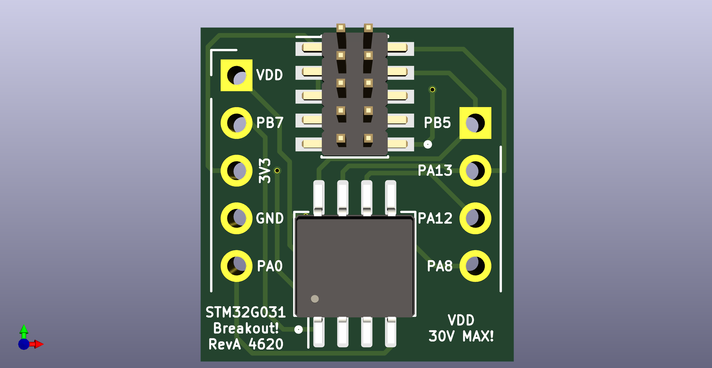
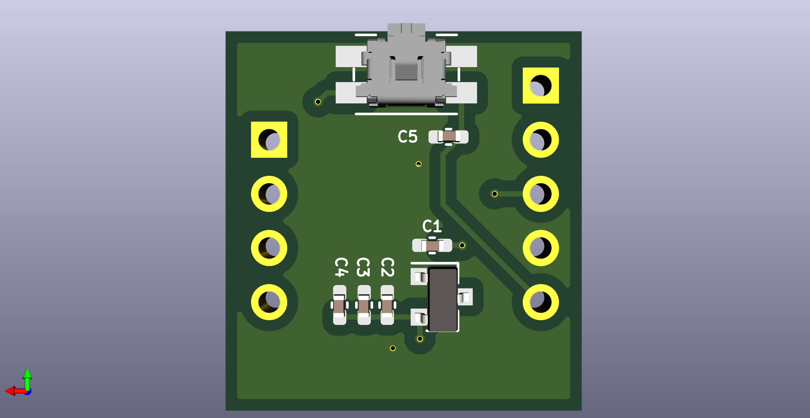
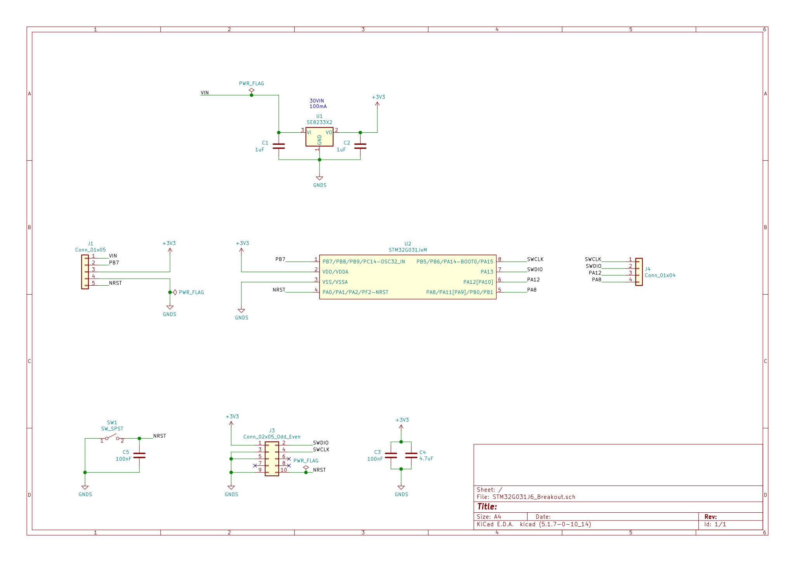

### STM32G031J6 (SO8N) Breakout ###

The microcontroller can be powered directly via its 3V3 pin or using the onboard LDO (Max 30V). The latter allows greater flexibility when using within existing circuitry that may not have an appropriate 3V3 rail.

The microcontroller can be programmed using the 2x5 SWD connector.

A low profile reset button is found on the back side of the board.

|Front Side|Back Side|
|:----------:|:---------:|
|

#### Schematic ####

Click [here](docs/bom/STM32G031J6_Breakout.csv)  for the bill of materials.

Click [here](docs/gerbers/STM32G031J6_Breakout_RevA.zip) for the gerbers.
